# Introducción

En este laboratorio se analizará cómo la jerarquía de memoria influirá en el rendimiento mediante la ejecución controlada de ejercicios en una máquina virtual. Se examinarán las características del hardware, se medirán latencias y se evaluará el comportamiento de la caché bajo patrones secuenciales y aleatorios. Asimismo, se explorará cómo mecanismos arquitectónicos, como las líneas de caché y el prefetching, afectan el desempeño.

# Metodología experimental

Para la ejecución del laboratorio se empleó una máquina virtual configurada en VMWare Workstation 25 utilizando una imagen preinstalada de **Kali Linux 2025.4**. La VM fue configurada con recursos acordes a las recomendaciones del Dr. Silvio Palacios, asignando CPU, memoria RAM y almacenamiento de manera controlada para asegurar reproducibilidad. Como primer paso, se capturó la información del hardware virtualizado mediante herramientas del sistema, lo que permitió identificar la arquitectura, la jerarquía de caché y la configuración de memoria disponible.

Posteriormente, se desarrollaron scripts en **bash** para automatizar la ejecución de los experimentos de rendimiento.

  

## Capturas de pantalla de la configuración de la máquina virtual

Para el laboratorio se utilizó VMWare Workstation 25. Desde el sitio oficial de Kali Linux se descargó una imagen preconfigurada de la versión 2025.4. Para la creación de la máquina virtual se seleccionó una configuración lo más cercana posible a la recomendada. En el repositorio se incluye el archivo VMDX con la configuración empleada. A continuación, se presentan las capturas de pantalla correspondientes a los parámetros más relevantes de la máquina virtual.

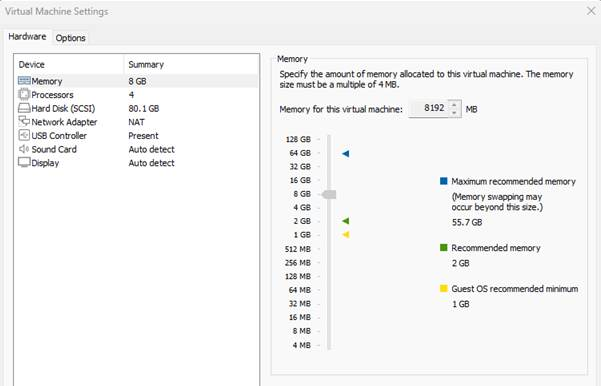

Ilustración 1 Configuracion de Memoria

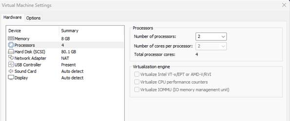

Ilustración 2 Configuración de CPU

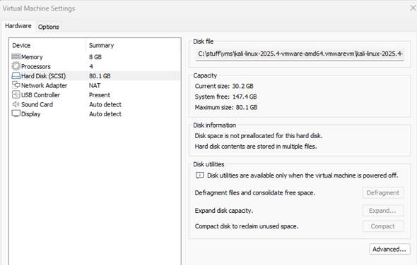

Ilustración 3 Configuración de Disco Duro y se puede visualizar el uso de NAT

  

## |  |
| --- |
|  |  |
  
Capturas de la ejecución de los comandos de verificación

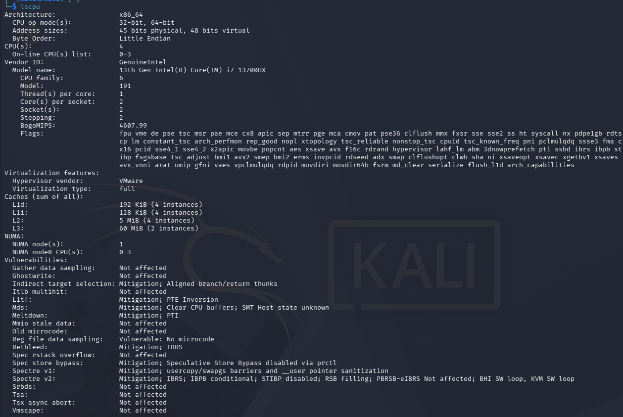

Ilustración 4 Salida de lscpu

La imagen muestra la salida del comando **lscpu** ejecutado, en ella se detalla la arquitectura y configuración del procesador asignado a la VM. El sistema identifica una arquitectura x86\_64, funcionando en modo de 32 y 64 bits, con un procesador **Intel Core i7-13700HX**. La máquina virtual está provisionada con **6 CPUs lógicas**, organizadas en 3 núcleos y 2 hilos por núcleo, y se puede ver que opera sobre la plataforma de VMware.

También se observa información relevante sobre la jerarquía de cachés (L1, L2 y L3). Finalmente, se puede ver las vulnerabilidades cubiertas, como las que vimos en clase de Spectre y Meltdown entre otras.

```
free -h
```


Ilustración 5 Salida de free

La imagen muestra la salida del comando **free -h**, donde se observa el estado actual del uso de memoria. El sistema cuenta con **7.7 GiB de RAM total**, de los cuales aproximadamente **1.2 GiB están en uso**, mientras que **991 MiB se encuentran libres**. El sistema reporta **6.6 GiB de memoria disponible**, lo que indica que la máquina tiene suficiente capacidad para ejecutar procesos.

```
lscpu | grep cache`
```

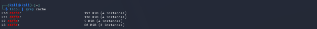

Ilustración 6 Filtro de  cache de lscpu

La imagen muestra la salida del comando lscpu | grep cache, donde se detalla la memoria caché del procesador. Se observa que el sistema cuenta con cuatro niveles de caché: la caché **L1d** con **192 KiB** en 4 instancias, la caché **L1i** con **128 KiB** en 4 instancias, la caché **L2** con **5 MiB** en 4 instancias y finalmente la caché **L3** con **60 MiB** en 2 instancias.

```
uname -a
```


La imagen muestra la salida del comando **uname -a**, donde se identifica la versión del kernel y el Kali. El sistema corre **kernel 6.16.8**, correspondiente a **Kali 2025**. Esta información valida la versión del sistema operativo utilizado durante el laboratorio y garantiza consistencia en los resultados obtenidos.

  

```
cat /proc/cpuinfo
```


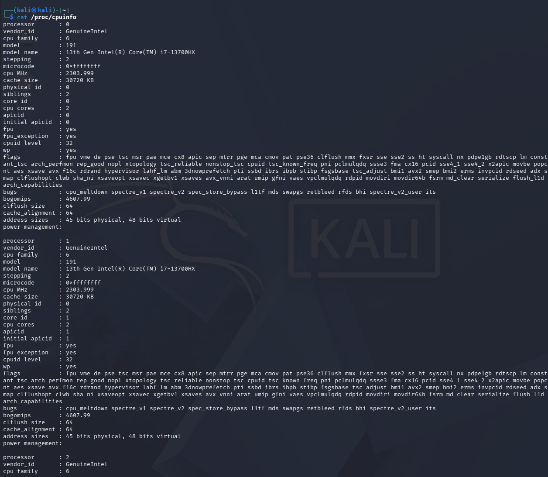

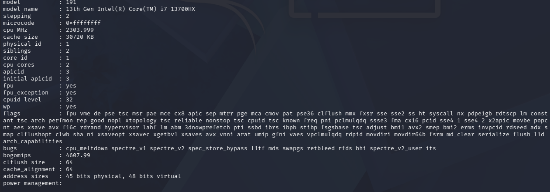

Ilustración 7 Salida de cat /proc/cpuinfo

La imagen muestra la salida del comando **cat /proc/cpuinfo**, donde se detalla la información completa del procesador asignado a la máquina virtual. En ella se observa que el sistema tiene un **Intel Core i7‑13700HX**, velocidad de 2.60 GHz, y múltiples núcleos y procesadores lógicos

```
dmidecode -t memory
```

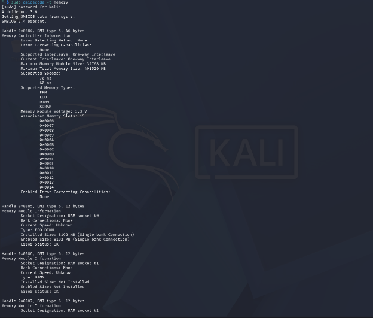

Ilustración 8 Salida de dmidecode

La imagen muestra la salida del comando **dmidecode -t memory**, donde se detalla la información relacionada con la memoria del sistema. Se listan las características soportadas, como los tipos de memoria reconocidos (ROM, RAM, SDRAM, DDR, entre otros) y las velocidades. Asimismo, se identifican los _memory slots_ disponibles en la máquina virtual: el sistema detecta un módulo instalado en el **socket 0** con una capacidad de **8192 MB**, mientras que otros sockets aparecen como no instalados, lo cual concuerda con la configuración asignada desde el VMWARE.

# Preguntas

## ¿Cuántos núcleos tiene el CPU?

De lscpu podemos ver: **Core(s) per socket: 2** y **Thread(s) per core: 2**

Tiene 2 nucleos, cada núcleo tiene 2 threads para un total: 2 × 2 = 4 CPUs lógicas.

## ¿Cuál es el tamaño de la cache L1?

Con base **a lscpu | grep cache** el tamaño de la **caché L1** se divide en dos:

**L1d:** 192 KiB (4 instancias) y **L1i:** 128 KiB (4 instancias)

## ¿Cuál es el tamaño de la cache L2?

El tamaño de **caché L2** según **lscpu | grep cache** nos muestra **5 MiB en 4 instancias.**

## ¿Cuál es el tamaño de la cache L3?

El tamaño de **caché L3** según **lscpu | grep cache** nos muestra **60 MiB en 2 instancias.**

## ¿Qué arquitectura utiliza el sistema?

El sistema utiliza una **arquitectura x86\_64** (también conocida como _AMD64_). Esto lo podemos observar en la captura de **uname -a.**

## Explique cómo esta configuración puede influir en el rendimiento del sistema.

La configuración asignada a la VM influye directamente en el rendimiento del sistema, determina cuántos recursos físicos puede aprovechar. En este caso, el procesador está limitado a **2 núcleos y 2 hilos**, lo cual es inferior a lo que el procesador podría ejecutar si corriéramos el Kali directo en la PC. La jerarquía de memoria caché también influye: las cachés L1, L2 y L3 proporcionan distintos niveles de almacenamiento rápido que reducen la latencia en el acceso a datos e instrucciones. Además, los **7.7 GB de RAM** permiten que las aplicaciones se ejecuten siempre y cuando no tengan necesidades más altas, que requeriría paginación. Finalmente, el uso de una arquitectura **x86\_64** optimiza el soporte para instrucciones de 64 bits para no correr en 32 bits.

  

## Scripts utilizados para ejecutar los benchmarks y código desarrollado durante el laboratorio

A manera de ejercicio decidí hacer un solo script en bash que cumpliera con:

1.    Ejecutar todos los comandos para hacer lo benchmarks

2.    Hiciera múltiples corridas para poder recopilarlas y hacer el promedio

3.    Generar un CSV con los resultados

4.    Generar la tabla de salida a partir del CSV

5.    Generar el gráfico a partir del CSV

6.    Mostrará el gráfico

A manera ilustrativa se incluye el código en la siguiente imagen. Para ver el detalle completo, el mismo está disponible en el repositorio

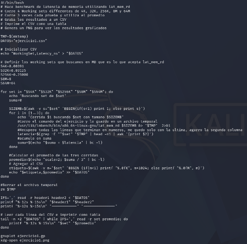

Ilustración 9 Script utilizado para el laboratorio

## Generación de las gráficas

En sustitución a Google Colab realizé la generación con una herramienta llamada **gnuplot**. Esta herramienta permite generar gráficos desde línea de comando lo cual me pareció ideal para mi caso de uso de un solo script. El gnuplot trabaja definiéndole un archivo en un formato especifico.

```
set datafile separator ","
set terminal pngcairo size 800,600 enhanced font 'Arial,12'
set output 'ejercicio1.png'
set title "Latencia de Memoria"
set xlabel "Working Set"
set ylabel "Latencia (ns)"
set xrange [0.5:5.5]
set grid
set style data linespoints
set xtics ("4K" 1, "32K" 2, "256K" 3, "8M" 4, "64M" 5)
plot "ejercicio1.csv" using ($0+1):2 skip 1 with linespoints title "Latencia"
```
 

## Resultados obtenidos durante los experimentos

Al hacer todo en un solo script es muy fácil y rápido de reproducir en diferentes ambientes que dispongan de **bash.** Con un solo comando se obtiene el cuadro de resumen y el gráfico

**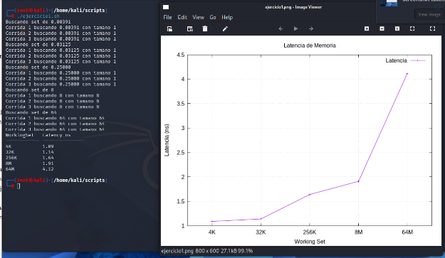**

Ilustración 10 Resultado de script de ejercicio

  

Al hacer un script, necesitamos validar que hacerlo de esta manera no genere ruido. Para validarlo se comparó con un resultado manual corriendo 64MB. Lo cual podemos ver que tiene resultados similares

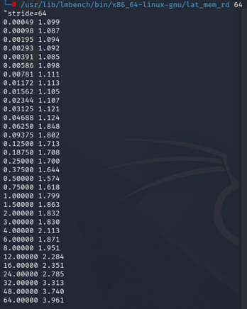

Ilustración 11 Resultados Aproximados para referencia

## ¿En qué puntos de la gráfica se observan transiciones entre niveles de cache?

Las transiciones de nivel de cache son:

1.    Aproximadamente a 256 K vemos la transición de L1 a L2.

a.    Hasta 32 K todo cabe cómodamente en L1 (192 KiB); al pasar a 256 K se excede L1 y la latencia sube por acceder a L2.

2.    Aproximadamente a 8 M vemos la transición de L2 a L3.

a.    8 M supera la L2 (5 M), lo que produce otro incremento al L3.

3.    Aproximadamente a 64 M vemos la transición de L3 al RAM.

a.    64 M rebasa la L3 (60 M); por eso aparece el salto grande.

## ¿Cómo se relaciona esto con la jerarquía de memoria del sistema?

Esto es congruente con lo que habíamos leído en la lectura científica de esta semana:

1.    L1 es muy pequeña pero extremadamente rápida (del orden de 1–4 ns).

2.    L2 es más grande, pero más lenta.

3.    L3 es aún mayor y más lenta.

4.    RAM es mucho más grande, pero cientos de veces más lenta.

## ¿Por qué aumenta la latencia cuando el working set supera el tamaño de cache?

Cuando el conjunto de datos que se está accediendo (working set) ya no cabe completo en un nivel de caché, empiezan a ocurrir cache-misses, y esto obliga al procesador a buscar la información en el siguiente nivel de memoria y cada nivel es más grande pero más lento que el anterior.

  

# Experimento de Comportamiento de Cache

El ejercicio 2 también se implementó en **bash**. Se realizaron pruebas con distintos tamaños de arreglo hasta identificar uno cuyo tiempo de ejecución fuera de al menos unos segundos en cada caso. Para simplificar la ejecución, se creó un único script que incluye ambas corridas del experimento.

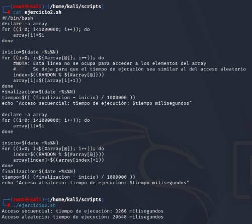

Ilustración 12 Script y Ejecucion de Experimento de Comportamiento de Cache

## ¿Cuál patrón fue más rápido?

El patrón **secuencial** fue 6x más rápido. El **secuencial** fue 3266 ms y el **aleatorio** fue 20648 ms

## ¿Por qué el acceso secuencial es más eficiente?

El acceso secuencial es más eficiente porque **aprovecha la localidad espacial** y el comportamiento interno de las cachés.

## Explique el papel de locality of reference, cache lines y hardware prefetching

Cuando el CPU accede a una dirección, no trae solo ese dato carga **la cache line** y si el siguiente elemento está contiguo, como ocurre en acceso secuencial, ya estará precargado y se activa el **hardware-prefetching** que cuando el acceso sigue un patrón predecible, y puede anticiparse y traer por adelantado las próximas líneas de caché antes de que el programa las necesite.

# Implicaciones de Seguridad en Flush+Reload

**Flush + Reload** es un side-channel attack basado en caché que aprovecha la diferencia de tiempo entre un **cache hit** y una cache miss para averiguar si otro proceso accedió a una dirección de memoria compartida. El atacante primero ejecuta cflush para expulsar una línea de caché. Luego espera a que el proceso se ejecute y, finalmente, realiza un reload midiendo el tiempo: si el acceso es rápido, el proceso trajo la línea nuevamente al caché; si es lento, no la usó. De esta forma, el atacante puede inferir patrones de acceso a memoria del proceso víctima con alta precisión, incluso a nivel de líneas individuales.

# Conclusiones Arquitectónicas

Los ejercicios realizados permiten comprender de manera clara cómo la jerarquía de memoria influye directamente en el rendimiento del sistema. Las pruebas de latencia mostraron las transiciones claras entre los niveles L1, L2 y L3, confirmando el comportamiento escalonado previsto: niveles superiores más pequeños y rápidos, y niveles inferiores más grandes, pero con mayor latencia. Asimismo, la marcada diferencia entre los tiempos de acceso secuencial y aleatorio demostró la importancia de la localidad de referencia, el tamaño de las cache lines y el rol del hardware prefetching, mecanismos que optimizan el acceso secuencial pero no son tan efectivos frente a patrones aleatorios.  

# Bibliografía

| [1] | D. Franklin, Computer Architecture: A Quantitative Approach, 2017. |
| --- | --- |